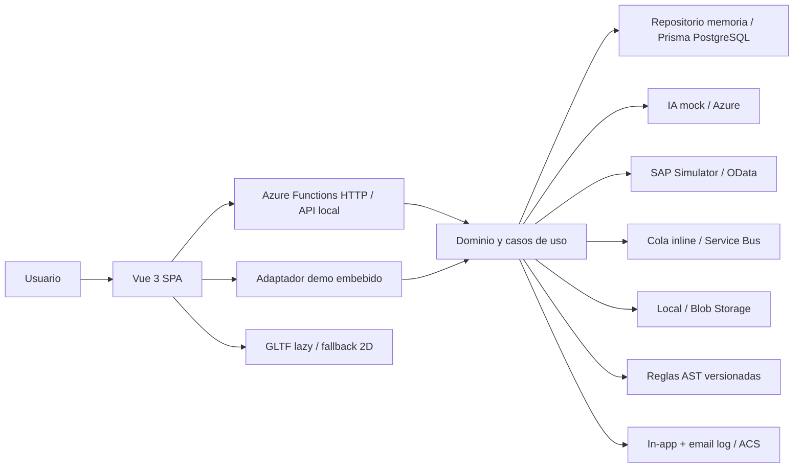

# Arquitectura de Forjadata

Forjadata es un monolito modular desplegable con una SPA Vue 3 y límites de integración
explícitos. El modo demo conserva el recorrido completo sin depender de servicios de pago.

La SPA depende de contratos y puertos, no de proveedores. El API usa el mismo dominio que el
adaptador demo, lo que permite probar contratos sin fingir conectividad. Las transiciones de
workflow, permisos, normalización y cálculo de confianza viven en paquetes compartidos.

## Modos

- **Demo público:** datos sintéticos, persistencia local del navegador y simuladores.
- **Local integrado:** API HTTP, SAP Simulator y memoria; PostgreSQL/Azurite opcionales.
- **Azure:** Functions v4, PostgreSQL, Blob, Service Bus, Entra, IA y observabilidad
  configurables; email real deshabilitado hasta aportar remitente y destinatario.
- **Enterprise reference:** adaptadores reales con secretos gestionados y controles de red.

Las limitaciones y pasos de activación de cada proveedor se mantienen en su documento de
arquitectura y en Administración → Integraciones.
